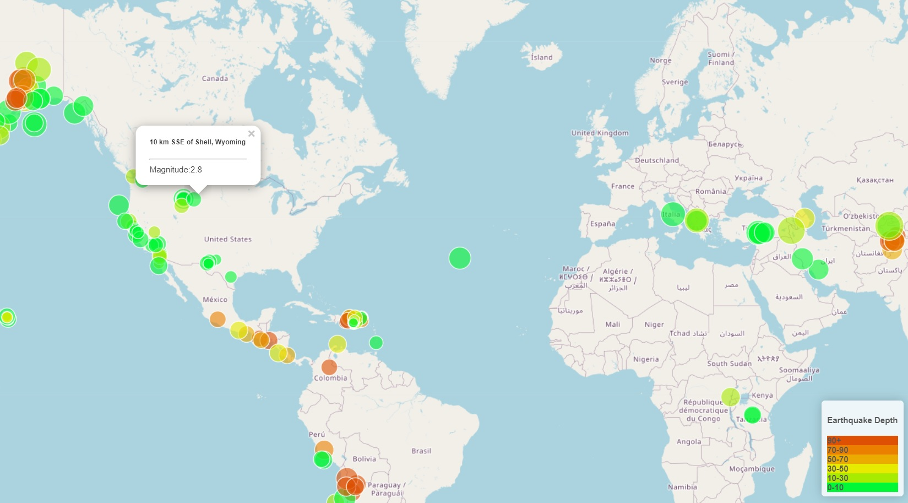

# leaflet-challenge
In this challenge, using Leaflet, I create an earthquake map for all earthquakes happend during the last week with magnitude greater than 2.5.The data provided in [USGS earthquake](https://earthquake.usgs.gov/earthquakes/feed/v1.0/geojson.php) in GeoJSON format. The data markers on the map reflect the magnitude of the earthquake by their size and the depth of the earthquake by color. Earthquakes with higher magnitudes appear larger, and earthquakes with greater depth appear darker in color.
It also includes popups that provide additional information about the earthquake when its associated marker is clicked.
The following image is an example screenshot of what appears when you visit this link:
 
 > 

# Resources
- Java Script file (logic.js) inside *static\js* 
- Html file (index.html)
- Css file (style.css) *static\css* 
